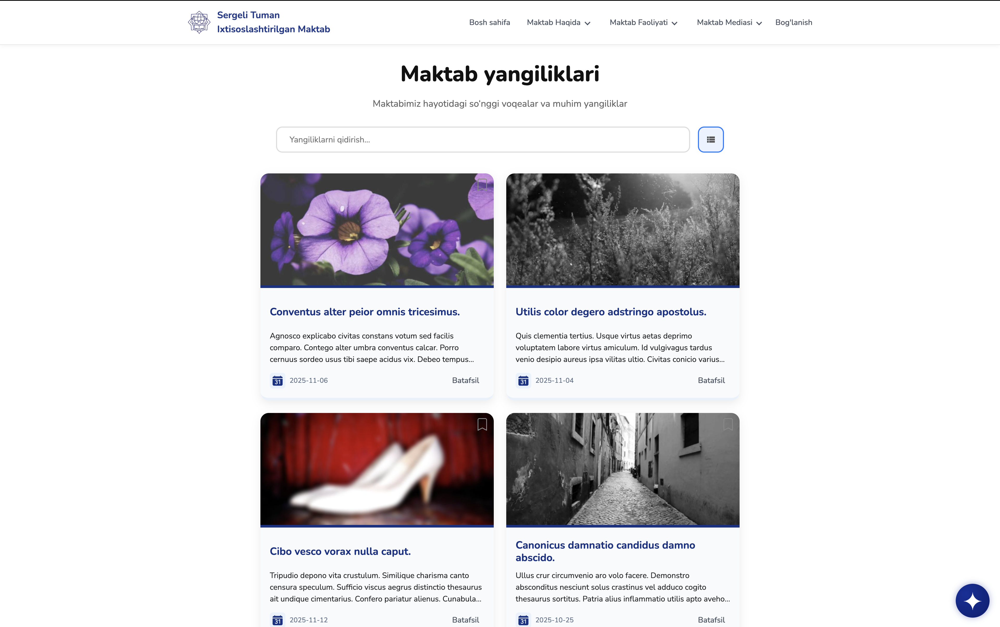
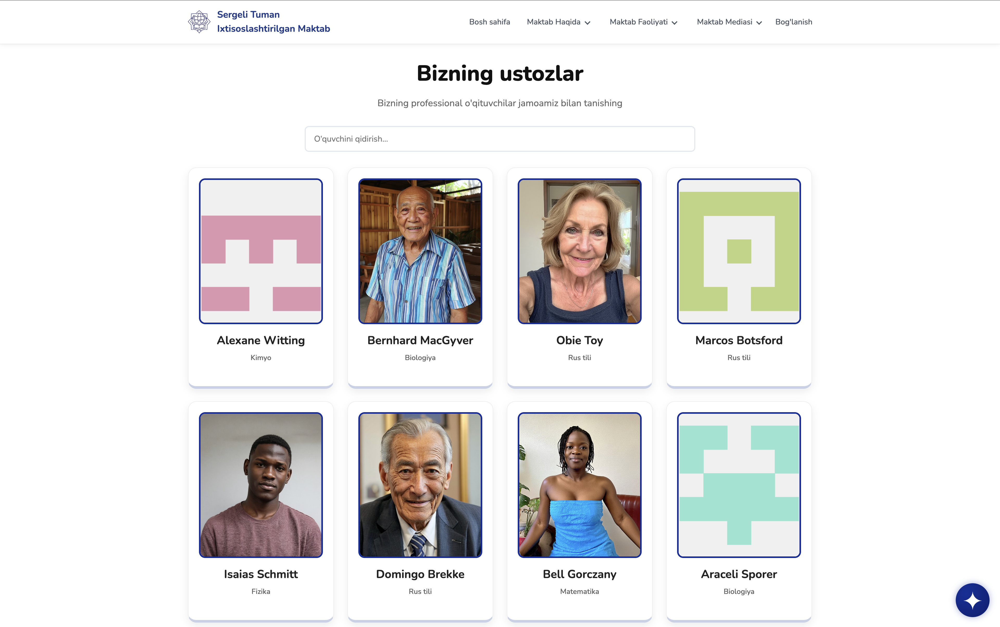
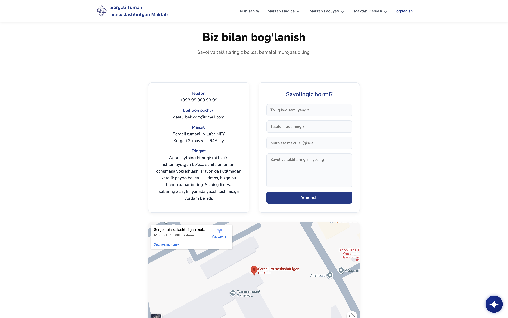
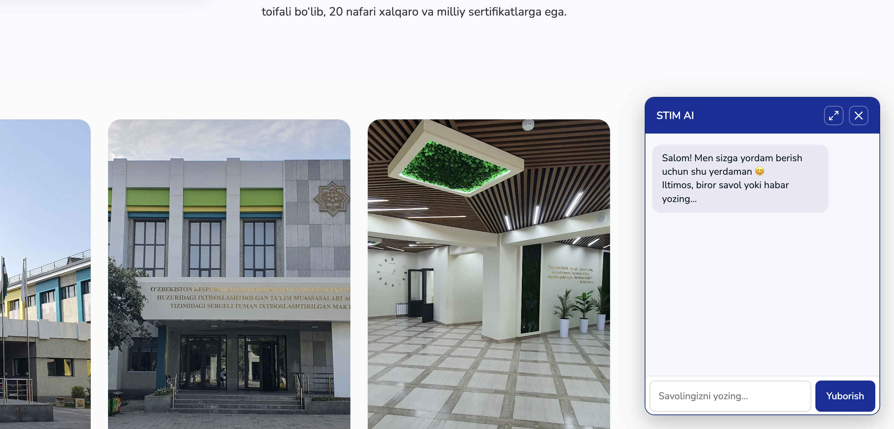

# 🏫 Sergeli Ixtisoslashtirilgan Maktab - Axborot Sayti

[](https://reactjs.org/)
[](https://vitejs.dev/)
[](https://www.w3.org/Style/CSS/)
[](https://developer.mozilla.org/en-US/docs/Learn/CSS/CSS_layout/Responsive_Design)
[](https://opensource.org/licenses/MIT)

> 🌟 **Zamonaviy, interaktiv va foydalanuvchi-do'st maktab axborot sayti** - Sergeli tumanidagi ixtisoslashtirilgan maktab uchun yaratilgan.


## 📖 Tavsif

Bu loyiha Sergeli tumanidagi ixtisoslashtirilgan maktab uchun yaratilgan to'liq funksional axborot va ma'lumotlar sayti. Sayt React texnologiyasi asosida qurilgan bo'lib, yangiliklar, e'lonlar, o'qituvchilar, to'garaklar va boshqa muhim ma'lumotlar bilan boyitilgan. Foydalanuvchilarga qulay navigatsiya, tez yuklanish va mobil moslashuvchan dizayn taqdim etadi.

### 🎯 Asosiy Maqsadlar

- 📚 Maktab haqida to'liq ma'lumot berish
- 📰 Yangiliklar va e'lonlarni real vaqtda yetkazish
- 👨‍🏫 O'qituvchilar haqida batafsil profil yaratish
- 🎨 To'garaklar va qo'shimcha faoliyatlar haqida ma'lumot
- 🤖 Sun'iy intellekt yordamida savollarga javob berish
- 📱 Barcha qurilmalarda mukammal ishlash

## ✨ Xususiyatlar

### 🚀 Asosiy Funksiyalar
- ✅ **Dinamik Yangiliklar** - API orqali real vaqtda yangilanuvchi yangiliklar
- ✅ **Interaktiv E'lonlar** - Muhim xabarlarni tez yetkazish
- ✅ **O'qituvchi Profillari** - Har bir ustoz uchun alohida sahifa
- ✅ **To'garaklar Bo'limi** - Maktabdagi barcha to'garaklar haqida
- ✅ **AI Chat Bot** - Google Gemini asosidagi yordamchi
- ✅ **Responsive Dizayn** - Desktop, tablet va mobil uchun
- ✅ **Smooth Animatsiyalar** - AOS kutubxonasi bilan
- ✅ **Bookmark Funksiyasi** - Sevimli yangiliklarni saqlash
- ✅ **Qidiruv Tizimi** - Tez ma'lumot topish

### 🎨 Dizayn Xususiyatlari
- 🎭 **Zamonaviy UI/UX** - Foydalanuvchi tajribasiga mos
- 🌈 **Gradient Effects** - Chiroyli rang o'tishlari
- 📱 **Mobile-First** - Avval mobil, keyin desktop
- 🎯 **Intuitive Navigation** - Oson navigatsiya
- ⚡ **Fast Loading** - Tez yuklanish uchun optimallashtirilgan

## 🛠 Texnologiyalar

### Frontend


### Kutubxona va Frameworklar
- **React Router DOM** - Sahifalar o'rtasida navigatsiya
- **AOS (Animate On Scroll)** - Sahifa animatsiyalari
- **React Icons** - Chiroyli ikonlar to'plami
- **Google Generative AI** - AI chat funksiyasi uchun

### Backend & API
- **JSON Server** - Ma'lumotlar bazasi simulyatsiyasi
- **REST API** - Ma'lumot uzatish
- **Fetch API** - Asinxron ma'lumot olish

## 📂 Loyiha Tuzilishi

```
school-website/
├── public/
│   ├── service-worker.js
│   └── logo.svg
├── src/
│   ├── components/
│   │   ├── Header/
│   │   ├── Footer/
│   │   ├── Chat/
│   │   ├── Layout/
│   │   └── ...
│   ├── pages/
│   │   ├── Home/
│   │   ├── News/
│   │   ├── Teachers/
│   │   ├── Contact/
│   │   └── ...
│   ├── App.jsx
│   ├── main.jsx
│   └── index.css
├── .env
├── package.json
├── vite.config.js
└── README.md
```

### 📄 Sahifalar
- **🏠 Home** - Asosiy sahifa, yangiliklar va e'lonlar
- **📰 News** - Yangiliklar ro'yxati va filtrlar
- **👨‍🏫 Teachers** - O'qituvchilar haqida ma'lumot
- **🎨 Talented Students** - Iqtidorli o'quvchilar
- **📞 Contact** - Aloqa ma'lumotlari va forma
- **📢 Announcements** - Muhim e'lonlar
- **🔬 Scientific Works** - Ilmiy ishlar
- **📅 Schedule** - Dars jadvali

## 🚀 O'rnatish va Ishga Tushirish

### Talablar
- Node.js (v16 yoki undan yuqori)
- npm yoki yarn

### Qadamlar

1. **Repositoryni klonlash**
   ```bash
   git clone https://github.com/your-username/school-website.git
   cd school-website
   ```

2. **Kutubxonalarni o'rnatish**
   ```bash
   npm install
   ```

3. **Environment faylini yaratish**
   ```bash
   cp .env.example .env
   ```
   `.env` faylida API kalitlarini qo'shing:
   ```
   VITE_GOOGLE_GEMINI_API_KEY=your_api_key_here
   ```

4. **JSON Serverni ishga tushirish** (ma'lumotlar uchun)
   ```bash
   npx json-server --watch db.json --port 3000
   ```

5. **Saytni ishga tushirish**
   ```bash
   npm run dev
   ```

6. **Brauzerda ochish**
   ```
   http://localhost:5173
   ```

## 📸 Screenshots

### 🏠 Asosiy Sahifa

*Asosiy sahifa - yangiliklar va navigatsiya*

### 📰 Yangiliklar Sahifasi

*Yangiliklar ro'yxati va qidiruv funksiyasi*

### 👨‍🏫 O'qituvchilar Sahifasi

*O'qituvchilar profili va ma'lumotlari*

### 📞 Aloqa Sahifasi

*Aloqa formasi va Google Maps*

### 🤖 AI Chat

*Sun'iy intellekt yordamchi chat*

> 📝 **Eslatma:** Screenshotlarni `screenshots/` papkasiga qo'shing va yuqoridagi linklarni yangilang.

## 🎮 Foydalanish

### Navigatsiya
- Header menyusi orqali sahifalar o'rtasida o'ting
- Footer'da qo'shimcha linklar mavjud
- Mobile versiyada burger menyu ishlaydi

### Chat Bot
- Sahifa o'ng pastida Gemini ikonasi
- Savollaringizga AI yordam beradi
- Maktab haqida ma'lumot olish uchun foydalaning

### Responsive Dizayn
- Desktop: To'liq funksiyalar
- Tablet: Moslashuvchan layout
- Mobile: Touch-friendly interfeys

## 🤝 Hissa Qo'shish

Hissa qo'shishni xohlaysizmi? Ajoyib!

1. Fork qiling
2. Feature branch yarating (`git checkout -b feature/amazing-feature`)
3. Commit qiling (`git commit -m 'Add amazing feature'`)
4. Push qiling (`git push origin feature/amazing-feature`)
5. Pull Request yarating

### Development Guidelines
- ESLint qoidalariga rioya qiling
- Componentlarni modulli yozing
- CSS BEM metodologiyasidan foydalaning
- Commit xabarlari aniq va tushunarli bo'lsin

## 📄 Litsenziya

Bu loyiha MIT litsenziyasi ostida tarqatiladi. Batafsil ma'lumot uchun `LICENSE` faylini ko'ring.

## 👥 Mualliflar

- **Jahongir To'xtayev** - Frontend Developer & UI/UX Designer
- **Adham Jabborov** - Frontend Developer

## 🙏 Rahmat

- React jamoasiga ajoyib framework uchun
- Google Gemini jamoasiga AI API uchun
- Barcha open-source contributorlarga

---

<div align="center">

**🌟 Bu saytni yoqtirdingizmi? GitHub'da yulduzcha qo'ying! 🌟**

[](https://github.com/your-username/school-website)
[](https://github.com/your-username/school-website/fork)

</div>

---

**📧 Savollaringiz bormi?** [Aloqa sahifasiga o'ting](contact) yoki [issue oching](https://github.com/your-username/school-website/issues).